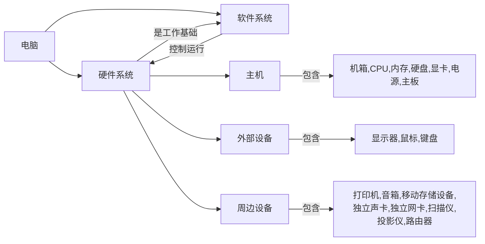

## 机箱

机箱内部放置各种电脑内部硬件，主要作用就是保护它们不被损坏。

购买机箱时，可以但不能只颜控，还要考虑机箱的大小、材质等等，最重要的一点就是它的散热性如何，它关乎到内部电子元件的性能发挥和寿命长短。

机箱尺寸分为：

- mini：支持ITX规格主板
- max：支持ITX、MATX主板
- 中塔：支持ITX、MATX、ATX主板
- 全塔：支持全部规格主板

机箱的散热性就看它支持的散热方式（风冷、水冷）和风道走向。

## 主板

主板是整个电脑内部的基座、桥梁，它上面有很多插槽和接口，插槽用来安放CPU、内存、硬盘、显卡、声卡、网卡等硬件设备，还为它们供电，需要考虑插槽类型；接口有USB接口、DP接口、HDMI接口、网卡接口、音频接口、风扇接口等等。

主板从小到大大致有ITX、MAXT、ATX、E-ATX这几种尺寸。

主板的重要参数：

- 供电能力
- 支持的CPU类型：如Intel、AMD等
- 支持的内存类型：如DDR4和DDR5
- 支持的硬盘类型：如SATA、M.2、PCIe等
- 是否支持内存和CPU超频
- 是否自带WIFI和蓝牙

## CPU





### CPU的作用

CPU（Central Processing Unit，中央处理器）负责执行系统指令，是系统的指挥控制中心，其职责主要包括数据计算、数据传输、逻辑控制和I/O（输入/输出）。

### CPU的外观

CPU正面刻有各种参数，反面布满了与CPU插槽接触的槽点。

### 市面情况

市面上主要有Intel（英特尔）、AMD（超威）两款CPU出售。

### 英特尔CPU规格

英特尔CPU的处理器规格一般就暗示了它的性能强弱，所以有必要认识下它的结构及各段含义。

英特尔的酷睿™（Core）N系列、酷睿™和酷睿™ Ultra是其常见的CPU系列。酷睿™ N系列主要服务于入门级的笔记本和台式机，酷睿™主要面向的是高性能笔记本和边缘设备，酷睿™ Ultra则同时面向高性能的笔记本、台式机和边缘设备。它们现在都已经衍变到了第二代。

以前说的i3、i5、i7就出自酷睿™这个产品品牌，他仨本身表示代次的意思。

从第12代酷睿开始，处理器内核就分为了Performance Core（P-Core，性能核）和Efficient Core（E-Core，效能核）。P-Core负责处理单线程、高优先级任务，E-Core则负责多线程任务，它两分工合作，使得笔记本性能进一步解放。

现在酷睿™ N系列、酷睿™和酷睿™ Ultra的最新处理器名称格式如下三图：





**酷睿™和酷睿™ Ultra的后缀：**

| **外形/功能类型/类别**                 | **后缀** | **经优化/设计面向**                      |
| -------------------------------------- | -------- | ---------------------------------------- |
| **台式机**                             | **K**    | **高性能，解锁（超频的意思）**           |
|                                        | **F**    | **需要独立显卡**                         |
|                                        | S        | 特别版                                   |
|                                        | T        | 功耗优化生活方式                         |
| **移动设备（笔记本电脑和二合一设备）** | HX       | 最高性能，所有 SKU 解锁                  |
|                                        | HK       | 最高性能，所有 SKU 解锁                  |
|                                        | **H**    | **性能最卓越**                           |
|                                        | P        | 性能优化适用于轻薄型笔记本电脑           |
|                                        | **U**    | **节能高效**                             |
|                                        | Y        | 极低功耗高效                             |
|                                        | G1-G7    | 显卡级别（采用较新集成显卡技术的处理器） |
| **嵌入式**                             | E        | 嵌入式                                   |
|                                        | UE       | 节能高效                                 |
|                                        | HE       | 高性能                                   |
|                                        | UL       | 节能，采用 LGA 封装                      |
|                                        | HL       | 最高性能，采用 LGA 封装                  |

当然，还有很多更常见的其他格式的处理器名称，下面一一举例。

英特尔® 酷睿™ 3 处理器 N350

英特尔® 酷睿™ i3-N300 处理器

英特尔® 酷睿™ i9-13900KS 处理器

英特尔® Core™ i9 处理器 14900KF

英特尔® 酷睿™ 7 处理器 160HL

参考链接：

[英特尔® 处理器名称、编号和代次列表](https://www.intel.cn/content/www/cn/zh/processors/processor-numbers.html)

[英特尔® 产品规范-处理器](https://www.intel.cn/content/www/cn/zh/ark.html#@Processors)

### AMD处理器规格

AMD处理器主要分为Ryzen（锐龙）系列、Threadripper（线程撕裂者）系列和EPYC（霄龙）系列。Ryzen面向普通消费者，适合日常办公、游戏和内容创作；Threadripper针对高端工作站用户，主打多核心高线程；EPYC则专为服务器设计。

AMD CPU的后缀（在SKU的左右）：

- X：指支持AMD官方超频XFR技术，也就是自动超频，频率的最大值受到散热器效果的影响，散热器越强，频率越高
- G：代表有核显，也就是常说的APU，集成Vega显卡
- 3D：代表使用了3D缓存
- WX：代表最新的超多核心线程撕裂者系列
- PRO：代表支持一些特别的数据安全技术
- U：有较低的功耗和Vega核显
- H：标准电压，不可拆卸，性能更强，常用在游戏本上

[AMD处理器规格](https://www.amd.com/zh-cn/products/specifications/processors.html)

## 内存

CPU处理数据过程中产生的临时数据需要存放在内存这个数据中转站，CPU完全依赖内存条，所有外存上的内容必须通过内存才能发挥作用，内存的容量和速度直接影响到CPU的性能。

内存一般采用半导体存储单元，包括随机存储器（RAM），只读存储器（ROM），以及高速缓存（CACHE）。只不过因为RAM是其中最重要的存储器。RAM的一个主要特征是断电后数据会丢失，平时说的内存是指这一种；而ROM的一个主要特征是断电后数据不会丢失。我们开机首先启动的是存于主板上ROM中的BIOS程序，然后再由它去调用硬盘中的Windows。

RAM分为静态RAM（SRAM）和动态RAM（DRAM），其中SRAM速度更快但成本更高，通常用于缓存，而DRAM则用于主内存。

> **BIOS**：BIOS是英文"Basic Input Output System"的缩写，它是启动时加载的第一个软件，固化在计算机内主板上一个ROM芯片上，保存着计算机最重要的基本输入输出的程序、开机后自检程序和系统自启动程序，它可从CMOS中读写系统设置的具体信息。其主要功能是为计算机提供最底层的、最直接的硬件设置和控制。

BIOS最初是在ROM上的，但是刻录就无法修改的特性使得一旦出现错误只能舍旧换新，**EPROM**（Erasable Programmable ROM，可擦除可编程ROM）的出现解决了这个弊端，但是其擦除操作极其不便，所以现在的更好的方案是采用**EEPROM**（Electrically Erasable Programmable ROM，电可擦除可编程ROM）。

内存的标准：

- **DDR4**：同样内核频率下理论速度是DDR3的两倍；更可靠的传输规范，数据可靠性进一步提升；工作电压降为1.2V，更节能。
- **DDR5**：与DDR4内存相比，DDR5标准性能更强，功耗更低。其它变化还有，电压从1.2V降低到1.1V，同时每通道32/40位（ECC）、总线效率提高、增加预取的Bank Group数量以改善性能等。与此同时，DDR5最重要的特性之一将是超过16 Gb的单片芯片密度。

## 硬盘

硬盘是用来长期保存数据的。

硬盘厂商在标称[硬盘容量](https://baike.baidu.com/item/%E7%A1%AC%E7%9B%98%E5%AE%B9%E9%87%8F/199466?fromModule=lemma_inlink)时通常取1GB=1000MB，因此我们在[BIOS](https://baike.baidu.com/item/BIOS/91424?fromModule=lemma_inlink)中或在格式化硬盘时看到的容量会比厂家的[标称值](https://baike.baidu.com/item/%E6%A0%87%E7%A7%B0%E5%80%BC/6418872?fromModule=lemma_inlink)要小。

**硬盘转速**：硬盘内电机主轴的旋转速度，也就是硬盘盘片在一分钟内所能完成的最大转数（RPM，Revolutions per minute）。RPM值越大，硬盘[寻找文件](https://baike.baidu.com/item/%E5%AF%BB%E6%89%BE%E6%96%87%E4%BB%B6/56375969?fromModule=lemma_inlink)的速度也就越快。

**硬盘数据传输率**：包括了内部数据传输率和外部数据传输率。

- 内部传输率(Internal Transfer Rate) 也称为持续传输率(Sustained Transfer Rate)，它反映了硬盘缓冲区未用时的性能。内部传输率主要依赖于硬盘的旋转速度。
- 外部传输率（External Transfer Rate）也称为突发数据传输率（Burst Data Transfer Rate）或接口传输率，它标称的是系统总线与硬盘缓冲区之间的数据传输率，外部数据传输率与硬盘接口类型和硬盘缓存的大小有关。

**硬盘的分类**：

- **固态硬盘**（SSD，Solid State Drive）：基于闪存芯片（NAND Flash）存储数据，无机械部件。
	- 优点：速度快（尤其是随机读写）、抗震、低功耗、无噪音。
	- 价格较高（单位容量成本比HDD高）、寿命受写入次数限制（但普通用户无需担心）。
- **机械硬盘**（HDD，Hard Disk Drive）：通过磁头在高速旋转的磁性盘片上读写数据。
	- 优点：容量大、价格低、寿命长。
	- 缺点：速度较慢（受转速影响）、怕震动、功耗较高。

**硬盘接口**：

- **SATA**：常见于HDD和早期SSD，速度较慢（最高约600MB/s）。
- **NVMe（PCIe）**：通过PCIe通道传输，速度快（可达数千MB/s），主流高端SSD接口。
- **M.2**：物理形态接口，可支持SATA或NVMe协议。
- **U.2**：企业级接口，支持高速NVMe协议。
- **SAS**：企业级HDD接口，比SATA更稳定，支持多线程。

## 显卡

显卡（Graphics Card，又称显示适配器）负责处理图形数据并输出图像到显示器，其作用不仅限于处理信号，还涉及计算加速、图形渲染、视频格式处理等任务。

**显卡两大生产厂商**：NVIDIA（GeForce RTX/GTX）和AMD（Radeon RX）。

**关键参数**：

1. **GPU核心**：其架构和规模决定基本性能。
2. **显存容量**：存储纹理和帧数据，分辨率越高，特效越复杂，显存需求越大。
3. **显存类型**：GDDR6/GDDR6X是主流。
4. **核心频率/加速频率**：影响运算速度。
5. **光追**（Ray Tracing）：提升游戏光影真实感。
6. **DLSS/FSR**：NVIDIA DLSS 和 AMD FidelityFX Super Resolution (FSR) 是利用 AI 或算法提升帧率的技术。

**显卡类别**：

- **集成显卡（核显）**：集成（固化）在CPU或主板中，功耗低，性能有限。占用系统内存作为显存。
- **独立显卡**：单独插在主板上，性能强，需要额外供电和散热。拥有单独的显存。
- **核芯显卡**：将GPU和CPU整合在一块基板上，缩短数据周转时间。

## 主机电源

关键参数：

- 额定功率：：
- 认证：电源转换效率的标准，

## 显示器

将显卡输出的信号（模拟信号或数字信号）以肉眼可识别的形式表现出来。

## 鼠标

## 键盘

## 音箱

## 打印机