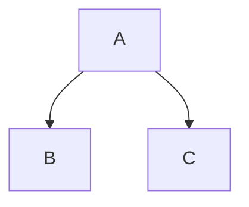

[toc]

# 主题测试文档

## 标题样式

### H3 标题

#### H4 标题

##### H5 标题

###### H6 标题

## 文本格式

这是一个段落，**加粗文本** ，*斜体文本*  ，~~删除线文本~~  ，==高亮文本==  ，`行内代码`  ，[超链接](https://typora.io)  ，这是一个段落，这是一个段落，这是一个段落，这是一个段落，这是一个段落，这是一个段落，这是一个段落，这是一个段落，这是一个段落，这是一个段落，这是一个段落，这是一个段落。

## 列表样式

### 无序列表

- 项目一
- 项目二
    - 嵌套项
    - 嵌套项
- 项目三

### 有序列表

第一项
    嵌套项
        嵌套项
            嵌套项
第二项

### 任务列表

- [x] 已完成任务
- [ ] 未完成任务

## 代码块

```javascript
function helloWorld() {
  console.log("Hello, World!");
}
```

```python
def hello_world():
    print("Hello, World!")
```

## 表格

| 左对齐     | 居中对齐   | 右对齐 |
| :--------- | :--------- | :----- |
| 单元格     | 单元格     | 单元格 |
| 长文本测试 | 合并列示例 | $1600  |

## 图片


## 数学公式

行内公式：$E = mc^2$

块级公式：
$$
\sum_{i=1}^{n} i = \frac{n(n+1)}{2}
$$

## 其他元素

### 水平线

---

### 引用块

> 这是引用的文本  
>
> 多行引用  
>
> > 嵌套引用 

### 脚注

这是一个带脚注的文本[^1]

[^1]: 这是脚注内容

## 代码主题

- [CodeMirror: Theme Demo](https://codemirror.net/5/demo/theme.html#ambiance)

- [codemirror5/theme at master · codemirror/codemirror5](https://github.com/codemirror/codemirror5/tree/master/theme)

## mermaid

